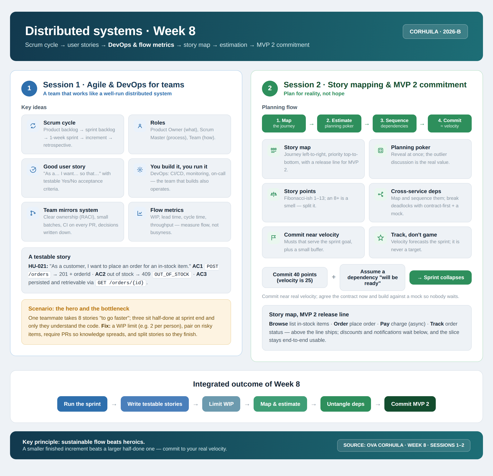

<!-- HU-STATUS TEMPLATE - do NOT remove the <!-- ... --> markers or the table headers.
     Your weekly grade is read AUTOMATICALLY from this file:
       08-week/hu-status/README.md  (inside YOUR fork). English. -->

# Weekly Status - Week 08

<!-- CONFIG-START - must match your profile repo (username/username) CONFIG -->
- FULL_NAME: Karen Johana Caicedo Arias
- GITHUB_USER: karencaicedo1907
- TEAM: CineSync Platform
- SPRINT_GOAL: Align the CineSync API contracts and architecture documentation, formalize the Concessions boundary decision, and prepare the updated documentation for review through branches and Pull Requests.
<!-- CONFIG-END -->

## 1. User stories worked this week
| HU ID | Title | Status (todo/doing/done) | Evidence (PR or commit URL) |
|---|---|---|---|
| HU-API-001 | Align OpenAPI contracts, routes, permissions, and shared references | done | `07-api/` documentation updates |
| HU-ARCH-008 | Define Concessions contract and inventory boundaries | done | ADR-008 in `05-architecture/` |
| HU-DOC-008 | Align Ticketing & Fulfillment and Concessions documentation | done | Commits, branches, and Pull Requests |

## 2. My individual contribution
- Updated and aligned the `07-api` documentation for CineSync Platform.
- Corrected OpenAPI contracts, routes, permissions, and shared references so that the documented API surface matches the architecture and service responsibilities.
- Updated the documentation for Ticketing & Fulfillment and Concessions, clarifying their capabilities and relationships with the rest of the platform.
- Created and documented ADR-008 in `05-architecture`, defining the contract limits and inventory ownership boundaries for Concessions.
- Updated the affected architectural references to keep the ADR, API documentation, service boundaries, and data ownership consistent.
- Organized the work through the required commits, branches, and Pull Requests, preserving a traceable review workflow.
- Applied the Week 8 planning principles by keeping the work organized into reviewable increments, identifying cross-folder dependencies, and preparing a realistic next slice rather than expanding scope without validation.

## 3. Blockers and risks
- The main risk was maintaining consistency between `07-api`, `05-architecture`, shared references, and the Concessions ownership decision.
- Changes to routes, permissions, or shared contracts can affect multiple services, so the documentation had to be reviewed as a connected set rather than as isolated files.
- The Concessions inventory boundary required an explicit architectural decision to avoid unclear ownership or accidental coupling between services.
- The Pull Requests and documentation changes are ready for review; any new observations may require synchronized updates across the API and architecture folders.

## 4. Plan for next week
- Monitor the Pull Request reviews and address any remaining observations from the reviewers or validation bot.
- Keep ADR-008, the OpenAPI contracts, and the service ownership documentation synchronized as implementation begins.
- Convert the updated contracts into testable MVP 2 stories with explicit acceptance criteria and service dependencies.
- Sequence the next end-to-end slice, estimate it according to the team's real capacity, and avoid committing more work than can be finished and validated.
- Define contract and integration checks for the API routes, permissions, Ticketing & Fulfillment flow, and Concessions inventory boundary.

## 5. Compliance self-check
- [x] Conventional Commits - `type(scope): summary`
- [x] Per-environment HU branch + PR to that environment (hu-xxx-dev -> develop, ...)
- [x] Testable acceptance criteria
- [x] Tests added/updated (unit / integration)
- [x] DDD / hexagonal boundaries respected (domain has no I/O)
- [x] No secrets; config via environment variables

## 6. Evidence links
- API documentation folder: `07-api/`
- Architecture documentation folder: `05-architecture/`
- ADR-008: Concessions contract and inventory boundaries
- Pull Requests: API and architecture documentation alignment

### Week 8 work summary

During this week, the CineSync Platform documentation was updated and aligned across the `07-api` and `05-architecture` folders. The work corrected OpenAPI contracts, routes, permissions, shared references, and the documentation for Ticketing & Fulfillment and Concessions.

The team also created and documented ADR-008, which defines the contract limits and inventory boundary for Concessions. The related architectural references were updated to ensure that the decision is reflected consistently in the API, service responsibilities, and ownership documentation.

The changes were delivered through the corresponding commits, branches, and Pull Requests so that the work remains traceable and reviewable. The updated documentation provides a clearer baseline for implementation and for the next MVP 2 planning cycle.

### Week 8 planning and DevOps alignment

The week's material reinforced the following practices applied to the CineSync work:

- Follow a Scrum cycle from product backlog to sprint backlog, increment, and retrospective.
- Write user stories with clear, testable acceptance criteria.
- Track flow through WIP, lead time, cycle time, and throughput instead of measuring activity alone.
- Map cross-service dependencies before committing to an MVP 2 slice.
- Use small, reviewable Pull Requests and keep ownership and decisions documented.
- Estimate work realistically and commit near the team's actual velocity.
- Prioritize a finished, end-to-end increment over a larger collection of half-completed stories.

For CineSync, the updated API contracts and ADR-008 reduce ambiguity before implementation and help sequence the next end-to-end slice involving the catalog, booking, ticketing, and concessions capabilities.

### Week 8 summary session 1-2:

