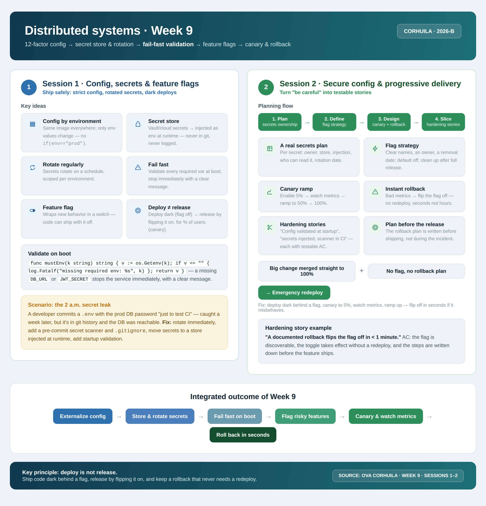

<!-- HU-STATUS TEMPLATE - do NOT remove the <!-- ... --> markers or the table headers.
     Your weekly grade is read AUTOMATICALLY from this file:
       09-week/hu-status/README.md  (inside YOUR fork). English. -->

# Weekly Status - Week 09

<!-- CONFIG-START - must match your profile repo (username/username) CONFIG -->
- FULL_NAME: Karen Johana Caicedo Arias
- GITHUB_USER: karencaicedo1907
- TEAM: CineSync Platform
- SPRINT_GOAL: Align the CineSync data documentation and complete the first independently reviewable Concessions portal delivery with secure configuration, typed contracts, tests, and CI/CD readiness.
<!-- CONFIG-END -->

## 1. User stories worked this week
| HU ID | Title | Status (todo/doing/done) | Evidence (PR or commit URL) |
|---|---|---|---|
| HU-DATA-009 | Align CineSync data models, diagrams, dictionary, and database decisions | done | Data documentation updates and PR audit record |
| HU-CONC-001 | Bootstrap the Concessions portal with typed domain and API foundations | done | PR1–PR4 branches and Pull Requests |
| HU-CONC-002 | Prepare Concessions CI/CD and deployment baseline | done | PR5 branch and Pull Request |

## 2. My individual contribution

### Data documentation and architecture alignment

- Updated and aligned the CineSync Platform documentation.
- Reviewed and corrected the data models, PostgreSQL and MongoDB ER diagrams, class model, data dictionary, and Booking and Concessions models.
- Applied Rule 2026-B so monetary values are represented as integer cents instead of floating-point amounts.
- Corrected the Concessions table names and updated `unit_price_snapshot` to match the documented ownership and persistence model.
- Removed the nonexistent `reservation_seats.price` field from the documentation.
- Clarified the difference between the physical MongoDB database `catalog_db` and the logical namespace `catalog`.
- Updated ADR-011 and organized the Pull Request audit record.
- Addressed the bot's recommendations through new commits, review comments, and an updated Pull Request description.

### Concessions portal implementation

- Worked on the implementation and organization of the Concessions portal following the architecture of `csp-booking-portal` and the contracts and guidelines defined in `csp-docs`.
- Prepared five independent Pull Requests to keep the delivery small, traceable, and independently reviewable:
  - **PR1:** governance configuration, README, and CODEOWNERS.
  - **PR2:** Native Federation configuration and remote exposure.
  - **PR3:** Angular standalone runtime scaffold, bootstrap, application configuration, and an empty router.
  - **PR4:** initial Concessions domain scaffold, typed models, lazy routes, placeholder pages, API service, `Idempotency-Key` support, cent-based money types, and unit tests.
  - **PR5:** initial CI/CD and deployment configuration.
- Corrected the main findings from automated reviews. In PR3, removed the premature dependency on PR4 routes and kept the router empty. In PR4, strengthened `MoneyInCents`, expanded idempotency tests, and added validation to reject negative monetary values.
- Kept the work isolated from the reference repositories and did not introduce changes to `-db` or `-api` repositories.

### Validation performed

- Lint completed successfully.
- Type-check completed successfully.
- Unit tests completed successfully with **6 passing tests**.
- Branches were updated and published to their corresponding remote branches.
- PR descriptions, commits, comments, and deferred findings were documented for final review.

## 3. Blockers and risks

- The main coordination risk was keeping the data documentation, API contracts, architecture decisions, and Concessions implementation consistent while working across multiple repositories and Pull Requests.
- Some findings were intentionally deferred to later stages because they depend on integrating the Concessions portal with the main CineSync frontend, adding authorization guards, and implementing the complete business flows.
- The Concessions portal is prepared for this stage, but its placeholder pages and API foundation still require integration with the production services before the feature can be considered end-to-end complete.
- Configuration and secrets remain a deployment concern. Runtime values must be injected by environment or a secret store, never committed to the repository or logged.

## 4. Plan for next week

- Close the pending Pull Requests after the final review and confirm their commits, descriptions, and branch status.
- Document the decisions associated with findings deferred to later stages.
- Connect the Concessions portal to the real API contracts and implement the next business flow increment.
- Add startup validation for required environment variables and fail fast with clear error messages when configuration is incomplete.
- Define a feature-flag, canary, and rollback strategy before exposing new Concessions behavior broadly.
- Continue validating the data, API, and frontend contracts together instead of reviewing them as isolated artifacts.

## 5. Compliance self-check
- [x] Conventional Commits - `type(scope): summary`
- [x] Per-environment HU branch + PR to that environment (hu-xxx-dev -> develop, ...)
- [x] Testable acceptance criteria
- [x] Tests added/updated (unit / integration)
- [x] DDD / hexagonal boundaries respected (domain has no I/O)
- [x] No secrets; config via environment variables

## 6. Evidence links

- Data documentation: `06-data/`, including models, ER diagrams, data dictionary, and ADR-011.
- Concessions portal: implementation branches and five independent Pull Requests (PR1–PR5).

### Week 9 work summary

The CineSync Platform documentation and Concessions portal foundations were updated in parallel. The documentation work aligned the data models, PostgreSQL and MongoDB ER diagrams, class model, data dictionary, Booking model, and Concessions model. Rule 2026-B was applied to represent monetary values as integer cents, table names and snapshots were corrected, the nonexistent `reservation_seats.price` field was removed, and the distinction between `catalog_db` and the logical `catalog` namespace was documented. ADR-011 and the Pull Request audit record were also updated in response to automated review feedback.

In the implementation track, the Concessions portal was organized into five independent Pull Requests covering governance, Native Federation, Angular runtime setup, the typed Concessions domain and API foundation, and CI/CD/deployment. The main automated-review findings were resolved: PR3 now has an empty router without a premature PR4 dependency, while PR4 includes stronger `MoneyInCents` typing, idempotency coverage, and negative-value validation.

The planned Concessions implementation for this stage is complete. Remaining work, such as final `csp-front` integration, authorization guards, and real business flows, was explicitly documented as future scope rather than hidden inside the current delivery.

### Week 9 technical alignment

The session material was applied to the delivery in the following ways:

- **Configuration by environment:** the same build should be deployable across environments while only runtime environment values change.
- **Secret management:** secrets must be injected at runtime, rotated regularly, and never committed or logged.
- **Fail-fast validation:** services and applications should validate required configuration at startup and stop with a clear error when a required value is missing.
- **Feature flags:** new behavior should be deployable dark and enabled deliberately, instead of coupling deployment and release.
- **Canary delivery:** expose a new behavior to a small percentage first, observe metrics, and increase exposure gradually.
- **Instant rollback:** turn off a feature flag or revert the release using a documented procedure without requiring an emergency redesign.
- **Hardening stories:** convert configuration validation, secret injection, CI scanning, flag ownership, and rollback into testable acceptance criteria.

These practices provide the next operational layer for Concessions: the code can be merged in small increments, validated independently, and released progressively without exposing unfinished business flows to every user.

### Week 9 summary session 1-2:

